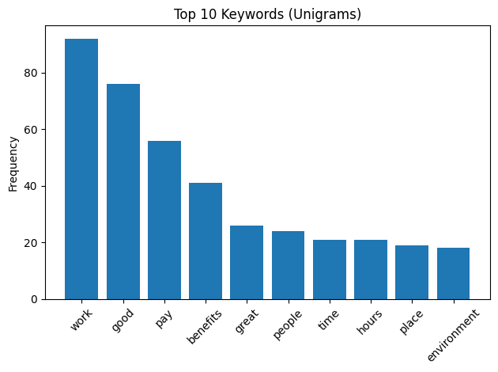

# Amazon Workforce Sentiment & Burnout Analysis

**Amazon Externship Project**

Analyzed 130+ employee feedback records from Glassdoor and YouTube to identify the root causes of burnout at Amazon fulfillment centers — and delivered actionable recommendations to leadership.

---

## The Problem

Amazon fulfillment center employees were experiencing significant burnout and exhaustion, but the volume of qualitative feedback made manual review impractical. The goal was to use data to systematically identify **what was causing burnout**, **who was most affected**, and **what could be done about it**.

---

## Data Sources

| Source | Format | Tone |
|---|---|---|
| Glassdoor Reviews | Structured (pros, cons, advice fields) | Mostly positive / neutral |
| YouTube Comments & Transcripts | Unstructured, free-form text | Predominantly negative |

The contrast between platforms was itself a key finding — Glassdoor feedback was measured and professional, while YouTube revealed the raw emotional frustration that formal reviews tend to soften.

---

## What I Did

- Ingested and analyzed **130+ unstructured employee feedback records** using Python (pandas, NLTK, TextBlob) to identify burnout and productivity risks impacting retention
- Built an **end-to-end NLP pipeline** to clean, preprocess, and classify sentiment and themes — enabling scalable, repeatable feedback analysis
- Synthesized findings into **5+ data-driven recommendations**, translating results into actionable insights for operational planning and workforce interventions

---

## NLP Pipeline

```
Raw CSV Data
    → Load into pandas DataFrames
    → Lowercase + remove punctuation
    → Strip English stopwords (NLTK)
    → Combine text fields into single cleaned column
    → Word frequency analysis (Counter)
    → Filter noise words
    → Sentiment classification (TextBlob)
    → Visualize top 10 keywords (Matplotlib)
```

---

## Visuals

### Amazon (Glassdoor) — Top Keywords


### YouTube — Top Keywords


---

## Key Findings

- **Burnout was the #1 theme** across both platforms — negative, emotionally charged feedback consistently pointed to exhaustion as the core issue
- **Full-time associates were hit hardest** — longest hours, most cumulative physical fatigue, most expensive to lose to turnover
- **Burnout drives a chain reaction:** burnout → lower morale → higher turnover → lower productivity
- **Production targets were set by algorithms** optimized for speed, with no adjustment for task difficulty or experience level
- **Break culture undermined recovery** — workload pressure made employees feel they couldn't afford to take their allotted breaks
- **YouTube revealed what Glassdoor softened** — the platform gap itself was a meaningful signal

---

## Recommendation

**Pilot: Task Rotation + Flexible Pacing**

Team leads rotate associates between tasks and adjust pacing during high-fatigue periods.

| Detail | Description |
|---|---|
| Where | One zone with full-time associates |
| Duration | 2-week pilot during high-volume shifts |
| Owner | Learning Ambassador / Floor Team Lead |
| Success Metrics | End-of-shift fatigue feedback, rotation frequency, reduction in strain complaints |

---

## Tools & Technologies

| Tool | Purpose |
|---|---|
| Python | Core analysis language |
| pandas | Data loading, cleaning, manipulation |
| NLTK | Stopword removal, text preprocessing |
| TextBlob | Sentiment classification |
| Matplotlib | Keyword frequency visualizations |
| Google Colab | Development environment |
| Excel | Data review and organization |

---

## Project Structure

```
amazon-externship/
├── Visuals/
│   ├── AmazonKewords.png
│   └── YoutubeKeywords.png
├── notebooks/
│   ├── final_amazon_pandas.py    # Data cleaning & validation
│   ├── keyword_amazon.py         # Glassdoor keyword analysis
│   ├── youtube_text.py           # YouTube text preprocessing
│   └── keyword_youtube.py        # YouTube keyword analysis
└── README.md
```

---

## Presentation

[View Executive Slides](https://docs.google.com/presentation/d/1aet6Slhmr4ElIhqv2aSs5YQYuEiR4LA6blf3l4LA2LI/edit)

---

## Author

**Nelson Pham**
Business Analytics Student — Cal State Fullerton

[Portfolio](https://nelsonpham64.github.io) · [LinkedIn](https://www.linkedin.com/in/nelsonpham64/) · [GitHub](https://github.com/nelsonpham64)
